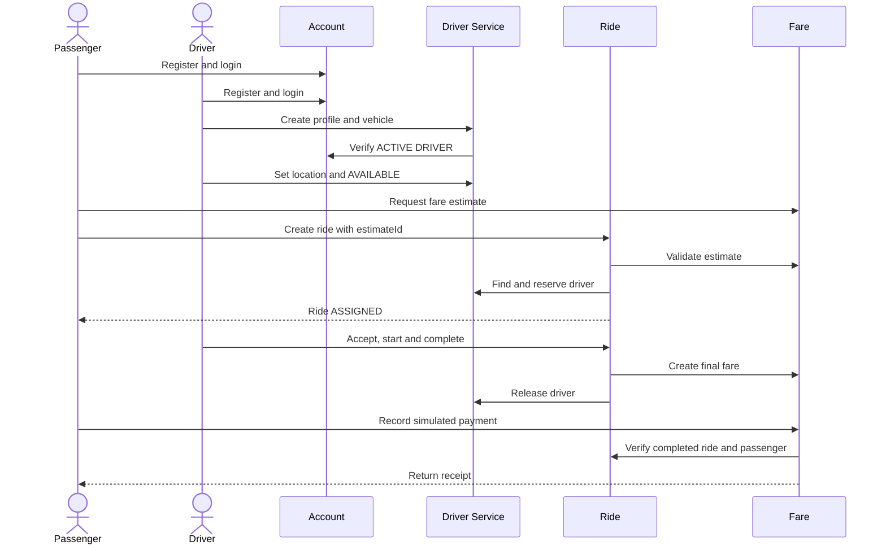

# RideLink API contract

Version: 1.0

Status: Team implementation baseline

Owner: RideLink group

Last updated: 22 September 2026

This document is the agreed contract for the four RideLink microservices. All code, Swagger pages, tests and Postman requests must follow it. A contract change must be discussed by the group and merged through a pull request before connected services are changed.

The assignment brief and later written lecturer instructions remain authoritative. Endpoint names and detailed rules in this document are team design decisions.

## 1. Design summary

| Service | Port | Database | Primary owner | Responsibility |
|---|---:|---|---|---|
| Account Service | 8081 | `account_db` | Member 1 | Accounts, login, JWT issuance, roles, profiles and account status |
| Driver & Vehicle Service | 8082 | `driver_db` | Member 2 | Driver operations, vehicle, location, service area, availability and reservation |
| Ride Management Service | 8083 | `ride_db` | Member 3 | Ride request, driver assignment, lifecycle, cancellation and ride retrieval |
| Fare & Payment Service | 8084 | `payment_db` | Member 4 | Estimates, final fare, simulated payment and receipts |

Rules:

1. Every service uses Java and Spring Boot.
2. Every service is independently executable.
3. Every service accesses only its own database.
4. Cross-service information is obtained through the APIs in this contract.
5. External operations use a user JWT. Internal operations use `X-Service-Token`.
6. There are no real maps, cards, banks or payment gateways.

## 2. Common HTTP contract

### 2.1 Base URLs

```text
Account: http://localhost:8081
Driver:  http://localhost:8082
Ride:    http://localhost:8083
Fare:    http://localhost:8084
```

External endpoints start with `/api/v1`. Internal service-to-service endpoints start with `/internal/v1`.

### 2.2 Data conventions

| Item | Decision |
|---|---|
| Identifier | UUID represented as a JSON string |
| Date and time | ISO-8601 UTC, for example `2026-09-22T10:30:00Z` |
| Content type | `application/json` |
| Currency | `LKR` only |
| Money | JSON number with two decimal places; Java `BigDecimal` |
| Distance | Kilometres; Java `BigDecimal`; range `0.10` to `100.00` |
| Coordinates | Optional simulated latitude and longitude |
| Text | Trim leading/trailing spaces; reject required blank values |

Never use floating-point `double` for money.

### 2.3 Common headers

External authenticated request:

```http
Authorization: Bearer <jwt>
X-Correlation-Id: <uuid>
```

Internal request:

```http
X-Service-Token: <environment-secret>
X-Correlation-Id: <uuid>
```

`X-Correlation-Id` is optional for clients. The first service creates one when absent and propagates it to connected services. The response returns the same value.

`Idempotency-Key` is required for ride creation and payment creation. It is a client-generated UUID. A repeated request with the same key and same body returns the original result. The same key with a different body returns `409 IDEMPOTENCY_CONFLICT`.

### 2.4 Status codes

| Status | Meaning |
|---:|---|
| 200 | Successful read, update or idempotent replay |
| 201 | Resource created |
| 204 | Successful operation with no response body |
| 400 | Invalid JSON, validation failure or malformed identifier |
| 401 | Missing, expired or invalid authentication |
| 403 | Authenticated caller lacks the required role or ownership |
| 404 | Resource does not exist or is not visible to the caller |
| 409 | Duplicate, illegal state transition or concurrency conflict |
| 422 | Request is valid JSON but violates a documented business rule |
| 503 | A required service is unavailable |

### 2.5 Standard error body

All four services use this shape:

```json
{
  "timestamp": "2026-09-22T10:30:00Z",
  "status": 409,
  "code": "DRIVER_NOT_AVAILABLE",
  "message": "The selected driver is not available",
  "path": "/internal/v1/drivers/6b8f/reservations",
  "correlationId": "aa9366fa-008e-40d5-9d32-2df885585922",
  "fieldErrors": []
}
```

Validation example:

```json
{
  "timestamp": "2026-09-22T10:30:00Z",
  "status": 400,
  "code": "VALIDATION_FAILED",
  "message": "One or more fields are invalid",
  "path": "/api/v1/fares/estimates",
  "correlationId": "aa9366fa-008e-40d5-9d32-2df885585922",
  "fieldErrors": [
    {
      "field": "distanceKm",
      "message": "must be between 0.10 and 100.00"
    }
  ]
}
```

Do not expose stack traces, SQL, password hashes, secrets or internal class names.

## 3. Authentication and authorization

### 3.1 User roles

```text
PASSENGER
DRIVER
ADMIN
```

The client cannot choose `ADMIN` during registration.

### 3.2 JWT decision

Account Service signs user tokens using HS256. The signing secret is stored in the `JWT_SECRET` environment variable in all four services and must never be committed.

Required claims:

```json
{
  "iss": "ridelink-account-service",
  "sub": "account-uuid",
  "role": "PASSENGER",
  "iat": 1790068000,
  "exp": 1790071600,
  "jti": "token-uuid"
}
```

| Claim | Meaning |
|---|---|
| `iss` | Must equal `ridelink-account-service` |
| `sub` | Authenticated account UUID |
| `role` | `PASSENGER`, `DRIVER` or `ADMIN` |
| `iat` | Issued-at time |
| `exp` | Expiry; 60 minutes after issue |
| `jti` | Unique token identifier |

No refresh token is required. The user logs in again after expiry.

Password requirements:

- 8 to 72 characters;
- at least one uppercase letter;
- at least one lowercase letter;
- at least one digit;
- stored only as BCrypt hash;
- never returned by an API.

### 3.3 Internal service authentication

All `/internal/v1/**` endpoints require:

```http
X-Service-Token: <SERVICE_TOKEN environment value>
```

Missing or incorrect token returns `401 INVALID_SERVICE_TOKEN`. User JWTs do not grant access to internal endpoints.

This shared token is acceptable for this simulated local assignment. The final report should identify secret rotation and separate per-service credentials as future improvements.

### 3.4 Required environment variables

These variable names are shared across the project:

```text
JWT_SECRET                 minimum 32 random characters
SERVICE_TOKEN              minimum 32 random characters
ACCOUNT_SERVICE_URL        default http://localhost:8081
DRIVER_SERVICE_URL         default http://localhost:8082
RIDE_SERVICE_URL           default http://localhost:8083
FARE_SERVICE_URL           default http://localhost:8084
```

Each service also retains its existing database environment variables. Real secret values belong in local environment settings or the repository host's secret store, never in Git.

## 4. Account Service contract

### 4.1 Account model

```text
accountId: UUID
email: string, lowercase, unique, maximum 254
passwordHash: internal only
role: PASSENGER | DRIVER | ADMIN
status: ACTIVE | SUSPENDED
fullName: string, 2-100 characters
phone: string, 7-20 characters
createdAt: timestamp
updatedAt: timestamp
```

### 4.2 Register passenger

`POST /api/v1/accounts/passengers` - Public

Request:

```json
{
  "email": "nimal@example.com",
  "password": "RideLink123",
  "fullName": "Nimal Perera",
  "phone": "+94771234567"
}
```

Response `201`:

```json
{
  "accountId": "793089e4-5e9b-4d62-a1f1-5e470691f5a5",
  "email": "nimal@example.com",
  "role": "PASSENGER",
  "status": "ACTIVE",
  "fullName": "Nimal Perera",
  "phone": "+94771234567",
  "createdAt": "2026-09-22T10:30:00Z"
}
```

Errors: `400 VALIDATION_FAILED`, `409 EMAIL_ALREADY_EXISTS`.

### 4.3 Register driver account

`POST /api/v1/accounts/drivers` - Public

Uses the same request and response fields. The server sets `role` to `DRIVER`. A role supplied by the client is rejected.

### 4.4 Login

`POST /api/v1/auth/login` - Public

Request:

```json
{
  "email": "nimal@example.com",
  "password": "RideLink123"
}
```

Response `200`:

```json
{
  "accessToken": "jwt-value",
  "tokenType": "Bearer",
  "expiresInSeconds": 3600,
  "accountId": "793089e4-5e9b-4d62-a1f1-5e470691f5a5",
  "role": "PASSENGER"
}
```

Errors: `401 INVALID_CREDENTIALS`, `403 ACCOUNT_SUSPENDED`.

### 4.5 View own profile

`GET /api/v1/accounts/me` - Any authenticated role

Returns the registration response fields. The account UUID is taken from JWT `sub`.

### 4.6 Update own profile

`PATCH /api/v1/accounts/me` - Any authenticated role

```json
{
  "fullName": "Nimal P. Perera",
  "phone": "+94771234567"
}
```

Only `fullName` and `phone` can be changed here.

### 4.7 Change account status

`PATCH /api/v1/accounts/{accountId}/status` - `ADMIN`

```json
{
  "status": "SUSPENDED"
}
```

Response `200` contains `accountId`, `role`, `status` and `updatedAt`.

### 4.8 Internal account summary

`GET /internal/v1/accounts/{accountId}/summary`

```json
{
  "accountId": "8f0c44df-d028-4687-bf49-5bca830a3fc4",
  "role": "DRIVER",
  "status": "ACTIVE"
}
```

This endpoint returns no name, phone, email or password data.

## 5. Driver & Vehicle Service contract

### 5.1 States and rules

Driver availability: `OFFLINE`, `AVAILABLE`, `RESERVED`.

Vehicle status: `ACTIVE`, `INACTIVE`.

- New profiles start `OFFLINE`.
- A driver needs an active vehicle and location before becoming `AVAILABLE`.
- Only Ride Service changes `AVAILABLE` to `RESERVED`.
- A reserved driver cannot manually change availability or replace the vehicle.
- Release with the matching `rideId` changes `RESERVED` to `AVAILABLE`.

### 5.2 Create operational profile

`POST /api/v1/drivers/me/profile` - `DRIVER`

```json
{
  "serviceArea": "COLOMBO",
  "locationName": "Bambalapitiya",
  "latitude": 6.8935,
  "longitude": 79.8552
}
```

Driver Service calls Account Service and confirms JWT `sub` belongs to an `ACTIVE DRIVER`.

Response `201`:

```json
{
  "driverId": "7e8dcce0-f46a-4cf1-a61f-d03d7219b224",
  "accountId": "8f0c44df-d028-4687-bf49-5bca830a3fc4",
  "serviceArea": "COLOMBO",
  "locationName": "Bambalapitiya",
  "latitude": 6.8935,
  "longitude": 79.8552,
  "availability": "OFFLINE"
}
```

Errors: `409 DRIVER_PROFILE_EXISTS`, `422 ACCOUNT_NOT_ACTIVE_DRIVER`, `503 ACCOUNT_SERVICE_UNAVAILABLE`.

### 5.3 View own driver profile

`GET /api/v1/drivers/me` - `DRIVER`

Returns the profile and current vehicle when present.

### 5.4 Create or replace vehicle

`PUT /api/v1/drivers/me/vehicle` - `DRIVER`

```json
{
  "registrationNumber": "CAB-1234",
  "vehicleType": "CAR",
  "manufacturer": "Toyota",
  "model": "Aqua",
  "colour": "White",
  "seatCapacity": 4,
  "status": "ACTIVE"
}
```

`vehicleType`: `CAR`, `VAN`, `THREE_WHEELER`. `seatCapacity`: 1 to 12.

Response: `201` when created, `200` when replaced. Errors: `409 REGISTRATION_NUMBER_EXISTS`, `409 DRIVER_RESERVED`.

### 5.5 Update availability

`PATCH /api/v1/drivers/me/availability` - `DRIVER`

```json
{
  "availability": "AVAILABLE"
}
```

Drivers may request only `AVAILABLE` or `OFFLINE`. Errors: `422 ACTIVE_VEHICLE_REQUIRED`, `422 LOCATION_REQUIRED`, `409 DRIVER_RESERVED`.

### 5.6 Update simulated location

`PATCH /api/v1/drivers/me/location` - `DRIVER`

```json
{
  "serviceArea": "COLOMBO",
  "locationName": "Wellawatte",
  "latitude": 6.8747,
  "longitude": 79.8605
}
```

No map service is called.

### 5.7 Find eligible drivers

`GET /internal/v1/drivers/eligible?serviceArea=COLOMBO&seatCount=2`

A driver is eligible when available, in the same service area, and has an active vehicle with enough seats.

```json
{
  "drivers": [
    {
      "driverId": "7e8dcce0-f46a-4cf1-a61f-d03d7219b224",
      "accountId": "8f0c44df-d028-4687-bf49-5bca830a3fc4",
      "serviceArea": "COLOMBO",
      "locationName": "Wellawatte",
      "vehicleType": "CAR",
      "seatCapacity": 4
    }
  ]
}
```

Sort by `driverId` ascending. This is a deterministic assignment rule without real maps.

### 5.8 Reserve a driver

`POST /internal/v1/drivers/{driverId}/reservations`

```json
{
  "rideId": "b7e96cc7-9b07-4c15-a313-317b443bafc7"
}
```

The database update must reserve only when availability is still `AVAILABLE`.

Response `201`:

```json
{
  "driverId": "7e8dcce0-f46a-4cf1-a61f-d03d7219b224",
  "rideId": "b7e96cc7-9b07-4c15-a313-317b443bafc7",
  "availability": "RESERVED",
  "reservedAt": "2026-09-22T10:40:00Z"
}
```

The same driver and ride returns `200`. A different ride receives `409 DRIVER_NOT_AVAILABLE`.

### 5.9 Release a driver

`DELETE /internal/v1/drivers/{driverId}/reservations/{rideId}`

Response `204`. Repeating the same release is `204`. A different ride ID receives `409 RESERVATION_MISMATCH`.

## 6. Fare & Payment Service contract

### 6.1 Fare rule

```text
currency = LKR
base fare = 250.00
distance rate = 80.00 per kilometre
fare = base fare + (distanceKm x distance rate)
rounding = 2 decimal places, HALF_UP
rule version = RIDELINK_2026_V1
estimate validity = 30 minutes
```

For 10.50 km: `250.00 + (10.50 x 80.00) = LKR 1,090.00`.

### 6.2 Create estimate

`POST /api/v1/fares/estimates` - Any authenticated role

```json
{
  "pickup": "Wellawatte",
  "destination": "Colombo Fort",
  "distanceKm": 10.50
}
```

Response `201`:

```json
{
  "estimateId": "db173594-901b-4203-834c-cc51f54c7c5f",
  "pickup": "Wellawatte",
  "destination": "Colombo Fort",
  "distanceKm": 10.50,
  "amount": 1090.00,
  "currency": "LKR",
  "ruleVersion": "RIDELINK_2026_V1",
  "createdAt": "2026-09-22T10:30:00Z",
  "expiresAt": "2026-09-22T11:00:00Z"
}
```

### 6.3 Get estimate internally

`GET /internal/v1/fares/estimates/{estimateId}`

Returns the estimate. An expired estimate returns `422 FARE_ESTIMATE_EXPIRED`.

### 6.4 Create final fare

`POST /internal/v1/fares/final`

```json
{
  "rideId": "b7e96cc7-9b07-4c15-a313-317b443bafc7",
  "passengerId": "793089e4-5e9b-4d62-a1f1-5e470691f5a5",
  "distanceKm": 10.50
}
```

Response `201`:

```json
{
  "fareId": "eb9f9365-528f-418d-b3a7-90792d45935c",
  "rideId": "b7e96cc7-9b07-4c15-a313-317b443bafc7",
  "passengerId": "793089e4-5e9b-4d62-a1f1-5e470691f5a5",
  "distanceKm": 10.50,
  "amount": 1090.00,
  "currency": "LKR",
  "ruleVersion": "RIDELINK_2026_V1",
  "createdAt": "2026-09-22T11:30:00Z"
}
```

`rideId` is unique. Same request returns `200`. Changed fields for the same ride return `409 FINAL_FARE_CONFLICT`.

### 6.5 Get final fare

`GET /api/v1/fares/rides/{rideId}` - Ride participant or `ADMIN`

Fare Service verifies access through Ride Service's internal summary.

### 6.6 Record simulated payment

`POST /api/v1/payments` - Ride passenger

Header: `Idempotency-Key: <uuid>`

```json
{
  "rideId": "b7e96cc7-9b07-4c15-a313-317b443bafc7",
  "simulationOutcome": "SUCCESS",
  "methodLabel": "SIMULATED_CARD"
}
```

`simulationOutcome`: `SUCCESS`, `FAILURE`. `methodLabel`: `SIMULATED_CARD`, `SIMULATED_CASH`.

Fare Service verifies through Ride Service that the ride is `COMPLETED` and the JWT user is its passenger.

```json
{
  "paymentId": "d108248c-a2a4-465e-a12c-46821dce17c4",
  "rideId": "b7e96cc7-9b07-4c15-a313-317b443bafc7",
  "amount": 1090.00,
  "currency": "LKR",
  "status": "PAID",
  "methodLabel": "SIMULATED_CARD",
  "recordedAt": "2026-09-22T11:35:00Z"
}
```

A simulated failure is recorded as `FAILED` and receives no receipt. Only one successful payment is allowed per ride.

### 6.7 Retrieve receipt

`GET /api/v1/payments/{paymentId}/receipt` - Payment owner or `ADMIN`

```json
{
  "receiptNumber": "RL-20260922-D108248C",
  "paymentId": "d108248c-a2a4-465e-a12c-46821dce17c4",
  "rideId": "b7e96cc7-9b07-4c15-a313-317b443bafc7",
  "passengerId": "793089e4-5e9b-4d62-a1f1-5e470691f5a5",
  "amount": 1090.00,
  "currency": "LKR",
  "paymentStatus": "PAID",
  "methodLabel": "SIMULATED_CARD",
  "issuedAt": "2026-09-22T11:35:00Z",
  "notice": "Simulated payment - no real money was transferred"
}
```

Failed payments return `422 RECEIPT_NOT_AVAILABLE`.

## 7. Ride Management Service contract

### 7.1 Ride states

```text
REQUESTED -> ASSIGNED -> ACCEPTED -> IN_PROGRESS -> COMPLETED
     |           |           |
     +-----------+-----------+----> CANCELLED
```

| Current | Next | Actor |
|---|---|---|
| `REQUESTED` | `ASSIGNED` | Ride Service after driver reservation |
| `REQUESTED` | `CANCELLED` | Passenger |
| `ASSIGNED` | `ACCEPTED` | Assigned driver |
| `ASSIGNED` | `CANCELLED` | Passenger |
| `ACCEPTED` | `IN_PROGRESS` | Assigned driver |
| `ACCEPTED` | `CANCELLED` | Passenger |
| `IN_PROGRESS` | `COMPLETED` | Assigned driver after final fare creation |

`COMPLETED` and `CANCELLED` are terminal. Cancellation during `IN_PROGRESS` is not supported in version 1.

### 7.2 Create ride and assign driver

`POST /api/v1/rides` - `PASSENGER`

Header: `Idempotency-Key: <uuid>`

```json
{
  "pickup": "Wellawatte",
  "destination": "Colombo Fort",
  "serviceArea": "COLOMBO",
  "distanceKm": 10.50,
  "seatCount": 2,
  "fareEstimateId": "db173594-901b-4203-834c-cc51f54c7c5f"
}
```

Processing order:

1. Take passenger ID from JWT `sub`.
2. Validate that the estimate exists, is unexpired and matches the trip.
3. Save `REQUESTED`.
4. Ask Driver Service for eligible drivers.
5. Try reservations in returned order.
6. Save both Driver Service's `driverId` and the driver's Account Service `accountId`, plus the estimate and `ASSIGNED`.
7. If the final save fails, release the reserved driver.

Response `201`:

```json
{
  "rideId": "b7e96cc7-9b07-4c15-a313-317b443bafc7",
  "passengerId": "793089e4-5e9b-4d62-a1f1-5e470691f5a5",
  "driverId": "7e8dcce0-f46a-4cf1-a61f-d03d7219b224",
  "pickup": "Wellawatte",
  "destination": "Colombo Fort",
  "serviceArea": "COLOMBO",
  "distanceKm": 10.50,
  "seatCount": 2,
  "estimatedFare": 1090.00,
  "currency": "LKR",
  "status": "ASSIGNED",
  "createdAt": "2026-09-22T10:40:00Z"
}
```

If no driver is reserved, keep `REQUESTED` and return `409 NO_AVAILABLE_DRIVER`. Automatic background reassignment is not required.

### 7.3 Retrieve and list rides

`GET /api/v1/rides/{rideId}` - Ride passenger, assigned driver or `ADMIN`.

`GET /api/v1/rides?status=COMPLETED&page=0&size=20`

- Passenger sees owned rides.
- Driver sees assigned rides.
- Admin sees all rides.
- Default page size 20; maximum 100.

### 7.4 Accept ride

`POST /api/v1/rides/{rideId}/accept` - Assigned `DRIVER`

Changes `ASSIGNED` to `ACCEPTED` and sets `acceptedAt`.

### 7.5 Start ride

`POST /api/v1/rides/{rideId}/start` - Assigned `DRIVER`

Changes `ACCEPTED` to `IN_PROGRESS` and sets `startedAt`.

### 7.6 Complete ride

`POST /api/v1/rides/{rideId}/complete` - Assigned `DRIVER`

1. Require `IN_PROGRESS`.
2. Call Fare Service to create final fare from stored distance and passenger ID.
3. Store final fare and change to `COMPLETED`.
4. Release Driver reservation.

If Fare Service fails, keep `IN_PROGRESS` and return `503 FARE_SERVICE_UNAVAILABLE`. If release fails after completion, keep the ride completed, log the failure and retry the idempotent release.

### 7.7 Cancel ride

`POST /api/v1/rides/{rideId}/cancel` - Ride passenger

```json
{
  "reason": "Plans changed"
}
```

Allowed from `REQUESTED`, `ASSIGNED` and `ACCEPTED`. Release an assigned driver. Response `200` contains `CANCELLED` and `cancelledAt`.

### 7.8 Internal ride summary

`GET /internal/v1/rides/{rideId}/summary`

```json
{
  "rideId": "b7e96cc7-9b07-4c15-a313-317b443bafc7",
  "passengerId": "793089e4-5e9b-4d62-a1f1-5e470691f5a5",
  "driverAccountId": "8f0c44df-d028-4687-bf49-5bca830a3fc4",
  "status": "COMPLETED",
  "distanceKm": 10.50,
  "finalFare": 1090.00
}
```

Fare Service uses this for authorization and payment checks.

## 8. Interservice communication

| Caller | Callee | Operation | Timeout | Retry | Failure action |
|---|---|---|---|---|---|
| Driver | Account | Verify active driver | Connect 2s, read 3s | Once on timeout/5xx | Do not create profile; return 503 |
| Ride | Fare | Validate estimate | Connect 2s, read 3s | Once on timeout/5xx | Stop assignment; return 503 |
| Ride | Driver | Find eligible drivers | Connect 2s, read 3s | Once on timeout/5xx | Keep `REQUESTED`; return 503 |
| Ride | Driver | Reserve driver | Connect 2s, read 3s | Once; ride reservation is idempotent | Try next driver after 409 |
| Ride | Driver | Release driver | Connect 2s, read 3s | Twice | Log unresolved failure |
| Ride | Fare | Create final fare | Connect 2s, read 3s | Once; `rideId` is unique | Keep `IN_PROGRESS`; return 503 |
| Fare | Ride | Verify ride/participant | Connect 2s, read 3s | Once on timeout/5xx | Do not expose/create; return 503 |

- Never retry `400`, `401`, `403`, `404` or business `409` automatically.
- Never wait without a timeout.
- Propagate `X-Correlation-Id`.
- Never invent dependency data to return success.
- REST is selected because the operations require immediate answers and are simple to demonstrate.
- A message queue is a possible future improvement for notifications and audit events.

## 9. Error code catalogue

### Common

```text
VALIDATION_FAILED
MALFORMED_JSON
INVALID_IDENTIFIER
AUTHENTICATION_REQUIRED
INVALID_TOKEN
TOKEN_EXPIRED
ACCESS_DENIED
RESOURCE_NOT_FOUND
IDEMPOTENCY_CONFLICT
INVALID_SERVICE_TOKEN
DEPENDENCY_UNAVAILABLE
```

### Account

```text
EMAIL_ALREADY_EXISTS
INVALID_CREDENTIALS
ACCOUNT_SUSPENDED
ACCOUNT_NOT_ACTIVE_DRIVER
```

### Driver

```text
DRIVER_PROFILE_EXISTS
DRIVER_PROFILE_NOT_FOUND
REGISTRATION_NUMBER_EXISTS
ACTIVE_VEHICLE_REQUIRED
LOCATION_REQUIRED
DRIVER_RESERVED
DRIVER_NOT_AVAILABLE
RESERVATION_MISMATCH
ACCOUNT_SERVICE_UNAVAILABLE
```

### Ride

```text
RIDE_NOT_FOUND
NO_AVAILABLE_DRIVER
INVALID_RIDE_TRANSITION
NOT_ASSIGNED_DRIVER
NOT_RIDE_PASSENGER
FARE_ESTIMATE_MISMATCH
FARE_ESTIMATE_EXPIRED
FARE_SERVICE_UNAVAILABLE
DRIVER_SERVICE_UNAVAILABLE
```

### Fare and payment

```text
FARE_ESTIMATE_NOT_FOUND
FARE_ESTIMATE_EXPIRED
FINAL_FARE_NOT_FOUND
FINAL_FARE_CONFLICT
RIDE_NOT_COMPLETED
RIDE_ALREADY_PAID
PAYMENT_NOT_FOUND
RECEIPT_NOT_AVAILABLE
RIDE_SERVICE_UNAVAILABLE
```

## 10. Data ownership

| Service | Owns | Must not own |
|---|---|---|
| Account | Email, password hash, role, account status and user profile | Vehicle, availability, ride, fare or payment |
| Driver | Driver operations, vehicle, area, location and reservation | Password, passenger profile, ride lifecycle or payment |
| Ride | Participant IDs, trip snapshot, lifecycle and fare snapshots | Password, vehicle master data or payment record |
| Fare | Estimate, fare rule, final fare, payment and receipt | Password, driver availability or ride lifecycle |

Cross-service IDs are expected. Foreign keys must never point into another service database.

## 11. Main demonstration sequence



## 12. Required negative demonstrations

The shared Postman collection must include:

1. Passenger updates driver availability -> `403 ACCESS_DENIED`.
2. Ride requested with no eligible driver -> `409 NO_AVAILABLE_DRIVER`.
3. Driver starts ride before accepting -> `409 INVALID_RIDE_TRANSITION`.
4. Payment before completion -> `422 RIDE_NOT_COMPLETED`.
5. Invalid distance or blank location -> `400 VALIDATION_FAILED`.
6. Wrong service token -> `401 INVALID_SERVICE_TOKEN`.

## 13. Endpoint implementation checklist

- [ ] Correct role and ownership check.
- [ ] Request DTO with Bean Validation.
- [ ] Response DTO; do not return JPA entities directly.
- [ ] Service-layer business rule.
- [ ] Repository uses only the service's own database.
- [ ] Standard error body through global exception handling.
- [ ] Swagger summary, examples and response codes.
- [ ] Unit tests for success, boundary and failure behaviour.
- [ ] Postman request for integrated operations.
- [ ] No secrets or real personal/payment data.

## 14. Contract change process

1. Change this document in a small pull request.
2. Tag every affected service owner.
3. Agree whether it is backward compatible.
4. Merge the contract change.
5. Update provider, caller, tests, Swagger and Postman.

Do not silently rename fields after another member has integrated them.

## 15. Team acknowledgement

This version is the group leader's selected implementation baseline. Every member must read their service section and connected service sections before coding. Corrections should be made through a repository issue or pull request so the decision remains traceable.
